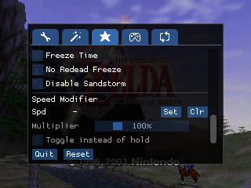
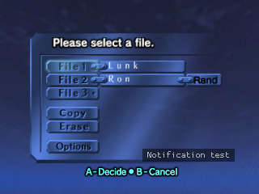
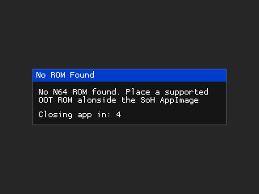
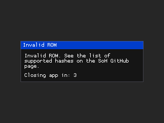
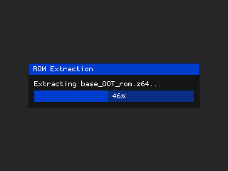

# Shipwright-CRT


A fork of [Ship of Harkinian](https://github.com/HarbourMasters/Shipwright) for **320x240 CRT** play, with a small controller-friendly settings UI, notifications, etc.

 
 
 

For Raspberry Pi Linux images (RGB-Pi, Batocera, Lakka, RetroPie, Recalbox, and similar). You need a legal OoT ROM (`.z64` / `.n64` / `.v64`). CRT UI is English-only. For the full SoH menu see [Harbour Masters](https://github.com/HarbourMasters/Shipwright). This fork keeps a small, useful slice of the full SoH menus.

## Download and run

1. Grab a release zip from [Releases](https://github.com/gustavostuff/Shipwright-CRT/releases)
2. Unpack it onto your Pi, put your OOT ROM in the same folder and run the AppImage:

```bash
chmod +x soh-raspberry-pi.AppImage
./soh-raspberry-pi.AppImage
# if FUSE is missing:
APPIMAGE_EXTRACT_AND_RUN=1 ./soh-raspberry-pi.AppImage
```

First launch extracts oot.o2r and the ROM too, running the game right away (no prompts).

  

## Build from source

Native builds only (no PC --> Pi cross-compile). Build scripts target [RGB-Pi OS4](https://www.rgb-pi.com/). PC builds work with `HOST_TARGET=pc`.

```bash
git clone --recursive https://github.com/gustavostuff/Shipwright-CRT.git
cd Shipwright-CRT
HOST_TARGET=pc ./scripts/linux/appimage/build.sh
# --> _packages/build-linux-x86_64/

# Pi AppImage from your PC (needs sshpass). Syncs onto /media/sd/soh-build.img on the Pi
# (creates that image if missing -- can take a while -- then mounts it):
./scripts/linux/deploy-on-pi.sh IP=192.168.1.10 USER=pi PASS=secret
# --> _packages/build-linux-arm64/
```

| HOST_TARGET | Output |
|--------|--------|
| `pc` | `_packages/build-linux-x86_64/` — `soh-pc.AppImage` + `soh-pc-<version>.zip` |
| `pi` | `_packages/build-linux-arm64/` — `soh-raspberry-pi.AppImage` + `soh-raspberry-pi-<version>.zip` |

AppImage names stay stable so launch scripts need not change. Versioned zips are the release artifacts (AppImage, `shipofharkinian.json`, Proggy Tiny). CRT fork version lives in `CRT_VERSION` (currently `0.0.2`), unrelated to upstream SoH.

## License

Follows Ship of Harkinian / Harbour Masters terms. Do not redistribute copyrighted ROMs.
