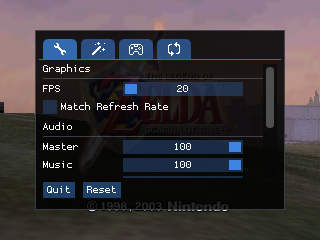
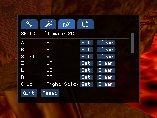
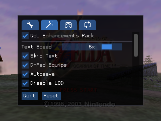
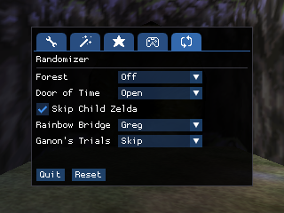

# Shipwright-CRT

A fork of [Ship of Harkinian](https://github.com/HarbourMasters/Shipwright) for **320x240 CRT** play, with a small controller-friendly settings UI.

 
 

[(click to see a hi-res CRT photo)](soh/assets/readme_images/CRT-photo.jpg)

**Play target:** Raspberry Pi Linux images in general (RGB-Pi, Batocera, Lakka, RetroPie, Recalbox, and similar). Drop in a release AppImage.

**Build / deploy scripts:** aimed at [RGB-Pi OS4](https://www.rgb-pi.com/) (paths like `/media/sd/soh-build.img`, SSH user `pi`, etc.). You can also build and test on a normal Linux PC (`HOST_TARGET=pc`). Compiling on other frontend images is not currently supported by these scripts.

## Download

Grab a prebuilt release zip from the GitHub [Releases](https://github.com/gustavostuff/Shipwright-CRT/releases) page. Unpack it; inside is a folder with the Pi AppImage and the other files you need. Drop that folder onto your Pi image, add a legal OoT ROM, and run. You do **not** need to compile for normal use.

See [Run](#run) below if the AppImage needs `APPIMAGE_EXTRACT_AND_RUN=1`.

## What you get

- Simplified CRT menu (not the full upstream SoH settings UI)
- Auto ROM to `oot.o2r` extraction on first launch
- AppImage packages that embed `soh.o2r` and extractor `assets/`

You still need a **legally obtained** Ocarina of Time ROM (`.z64` / `.n64` / `.v64`).

## CRT settings UI

Upstream SoH has a large desktop-oriented menu. This fork uses a compact modal meant for a CRT and a gamepad (keyboard and mouse are still supported though). The CRT UI is **English-only for now**. Several settings UI controls will not be migrated, I'll try to keep it simple. For the full SoH feature set, see [Harbour Masters](https://github.com/HarbourMasters/Shipwright).

## Build from source

Only needed if you are developing this fork or want a custom build. This is a **native** build only (no PC-->Pi cross-compile). Typical workflow: iterate on a PC, then deploy to an RGB-Pi box when you want a Pi AppImage.

### PC (develop / test)

```bash
git clone --recursive https://github.com/gustavostuff/Shipwright-CRT.git
cd Shipwright-CRT
git submodule update --init --recursive   # if the clone was not --recursive
HOST_TARGET=pc ./scripts/linux/appimage/build.sh
```

Output: `_packages/soh-pc.AppImage` plus `shipofharkinian.json`, `proggy-tiny.ttf`, and `proggy-tiny-licence.txt`.

### RGB-Pi OS4 (build from your PC)

Building on-device is set up for RGB-Pi OS4. Its rootfs is usually too small to `git clone` and compile there, so `deploy-on-pi.sh` syncs this checkout over the LAN onto a loop-mounted ext4 image (RGB-Pi-style defaults), builds there, and copies the AppImage back:

```bash
# From your PC, inside this repo (submodules already initialized):
./scripts/linux/deploy-on-pi.sh IP=192.168.1.10 USER=pi PASS=secret
```

That script will:

1. SSH to the Pi and mount `/media/sd/soh-build.img` --> `~/soh-build` (if needed)
2. `rsync` this tree to `~/soh-build/Shipwright-CRT` (skips `.git`, `build-cmake`, `_packages`)
3. Run `HOST_TARGET=pi ./scripts/linux/appimage/build.sh` on the Pi
4. Copy `soh-raspberry-pi.AppImage` (and sidecars) back into local `_packages/`

Requires `sshpass` on the PC (`sudo pacman -S sshpass` / `sudo apt install sshpass`). Optional: `--no-build` to sync only. `SUDO_PWD=` defaults to `PASS` for the loop mount.

Defaults assume RGB-Pi-style paths (`/media/sd/soh-build.img`, user `pi`). Override if your layout differs: `SOH_BUILD_IMG`, `SOH_BUILD_MOUNT`, `SOH_BUILD_TREE`.

| Target | AppImage |
|--------|----------|
| `pc` | `soh-pc.AppImage` |
| `pi` | `soh-raspberry-pi.AppImage` |

## Run

From an unpacked [Release](https://github.com/gustavostuff/Shipwright-CRT/releases) folder, or from `_packages/` after a local build:

```bash
cd /path/to/release-folder   # or _packages after building
# put your OoT ROM in this folder
chmod +x soh-raspberry-pi.AppImage   # or soh-pc.AppImage on a PC build
./soh-raspberry-pi.AppImage
```

If the AppImage cannot mount (common without FUSE):

```bash
APPIMAGE_EXTRACT_AND_RUN=1 ./soh-raspberry-pi.AppImage
```

First launch extracts `oot.o2r` beside the AppImage. There is no external `assets/` folder.

## License / upstream

Follows Ship of Harkinian / Harbour Masters terms. Do not redistribute copyrighted ROMs.
